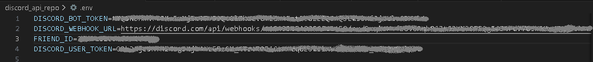

# Discord Bot & API Exploration

A hands-on project for learning how to build and interact with Discord bots using Python. This repo covers bot setup with commands, event handling, role management, direct messaging, webhook integration, and direct API calls — all secured through environment variables.

---

## Project Structure

```
discord_api_repo/
├── main.py           # Full-featured bot with commands, events, and role management
├── bot_dm.py         # Bot that sends a DM to a specific user on startup
├── personal_dm.py    # Direct Discord API call (no bot) to send a DM to a friend
├── webhook.py        # Sends an embed message to a channel via webhook
├── requirements.txt  # Python dependencies
└── images/           # Screenshots and reference images
```

---

## What Each File Does

### `main.py` — The Main Bot
The core bot built with `discord.py`. Demonstrates:
- Connecting to Discord and logging in with a bot token
- Listening to events (`on_ready`, `on_member_join`, `on_message`)
- Responding to messages and mentions
- Custom prefix commands (`!hello`, `!dm`, `!reply`, `!poll`)
- Role assignment and removal (`!assign`, `!remove`)
- Role-gated commands — only users with the `Gamer` role can use `!secret`
- Logging bot activity to a file (`discord.log`)

### `bot_dm.py` — Bot DM on Startup
A lightweight bot that fetches a specific user by ID and sends them a direct message as soon as the bot is ready, then shuts itself down. Useful for understanding how bots interact with users outside of a server channel.

### `personal_dm.py` — Raw API Direct Message
No bot involved — this script uses a **user token** and the Discord REST API directly (`discord.com/api/v10`) to open a DM channel with a friend and send them a message. Shows how the Discord API works at the HTTP level using the `requests` library.

> **Note:** Using a user token (self-bot) violates Discord's Terms of Service and is included here purely for educational/exploratory purposes.

### `webhook.py` — Webhook Embed Message
Uses a Discord webhook URL to POST an embedded message to a channel. No bot or user token needed — just a webhook URL. Demonstrates how to format Discord embeds with a title, description, and color.

---

## Environment Variables

All sensitive credentials are stored in a `.env` file that is **never committed to the repo**. Below is an example of what the `.env` file looks like:



Create a `.env` file in the root of the project with the following keys:

```
DISCORD_BOT_TOKEN=your_bot_token_here
DISCORD_TOKEN=your_bot_token_here
DISCORD_USER_ID=your_discord_user_id_here
DISCORD_USER_TOKEN=your_user_token_here
FRIEND_ID=your_friends_discord_user_id_here
DISCORD_WEBHOOK_URL=your_webhook_url_here
```

| Variable | Used In | Description |
|---|---|---|
| `DISCORD_BOT_TOKEN` | `main.py` | Bot token from the Discord Developer Portal |
| `DISCORD_TOKEN` | `bot_dm.py` | Bot token for the DM-on-startup script |
| `DISCORD_USER_ID` | `bot_dm.py` | Your personal Discord user ID (who receives the DM) |
| `DISCORD_USER_TOKEN` | `personal_dm.py` | Your personal user token (raw API usage) |
| `FRIEND_ID` | `personal_dm.py` | Discord user ID of the friend to DM |
| `DISCORD_WEBHOOK_URL` | `webhook.py` | Webhook URL generated in Discord channel settings |

---

## Setup & Installation

**1. Clone the repo**
```bash
git clone https://github.com/your-username/discord_api_repo.git
cd discord_api_repo
```

**2. Install dependencies**
```bash
pip install -r requirements.txt
```

**3. Create your `.env` file**

Copy the template above and fill in your credentials.

**4. Run a script**
```bash
# Run the main bot
python main.py

# Send a DM on startup
python bot_dm.py

# Send a DM via raw API
python personal_dm.py

# Fire a webhook embed
python webhook.py
```

---

## Bot Commands

All commands use the `!` prefix.

| Command | Description |
|---|---|
| `!hello` | Bot greets you by mention |
| `!dm <message>` | Bot slides into your DMs with your message |
| `!reply` | Bot replies directly to your message |
| `!poll <question>` | Creates an embed poll with 👍 / 👎 reactions |
| `!assign` | Assigns you the `Gamer` role |
| `!remove` | Removes the `Gamer` role from you |
| `!secret` | Exclusive command — only works if you have the `Gamer` role |

---

## Dependencies

```
discord.py
python-dotenv
requests
```

Install with:
```bash
pip install -r requirements.txt
```

---

## Key Concepts Covered

- Setting up a Discord bot via the [Discord Developer Portal](https://discord.com/developers/applications)
- Using `discord.py` with `commands.Bot` and Intent configuration
- Securing credentials with `python-dotenv` and `.env` files
- Event-driven programming with Discord events
- Interacting with the Discord REST API directly (no library)
- Sending webhook messages with embedded content
